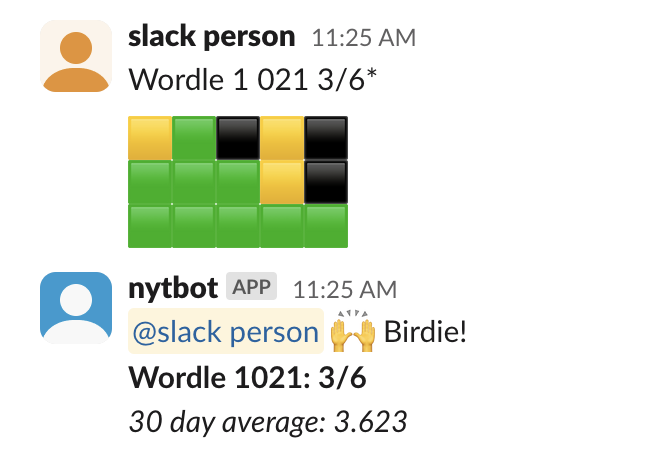

# Slack channel highscores for Wordle (etc.)

## Features 

### Game support

- [x] Wordle
- [x] Connections
- [ ] The Mini
- [ ] The Crossword

### Etc

- [ ] Scoreboard commands (e.g. `/nyt wordle top`)

## Setup

1. Create Slack app https://api.slack.com/apps  
    - Enable Socket mode
    - Add event subscriptions, e.g. `message.channels` for the bot to work in public channels
2. Get your secrets (see _.env.example_)
3. `$ npm i && npm start`